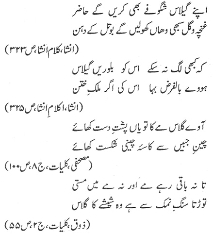

# Urdu OCR

This repository contains an improved Tesseract OCR model for extracting text from Urdu script images. Our custom-trained model `nawadraat_urdu` significantly outperforms the default Tesseract Urdu model in terms of text recognition quality.

## 🌟 Features

- Custom-trained Tesseract model for Urdu script recognition
- Higher accuracy compared to default Tesseract Urdu model
- Easy-to-use command-line interface
- Support for various image formats

## 📋 Requirements

- Python 3.x
- Tesseract OCR
- Required Python packages (add requirements.txt to your project)

## 🚀 Installation

1. Clone this repository:
```bash
git clone https://github.com/Nawadiraat/Urdu-OCR.git
cd Urdu-OCR
```

2. Install the required dependencies:
```bash
pip install -r requirements.txt
```

3. Download and place the model files in the `models` folder:
   - `urd.traineddata` (default Tesseract model)
   - `nawadraat_urdu.traineddata` (our improved model)

## 💻 Usage

Use the following command to extract text from an Urdu script image:

```bash
python main.py --image_path test_images/3.jpg --lang nawadraat_urdu
```

Parameters:
- `--image_path`: Path to the input image
- `--lang`: Language model to use (options: `urd`, `nawadraat_urdu`)

## 📊 Model Performance

Latest training metrics (Iteration 9724/10000/10009):
- Mean RMS: 2.125%
- Delta: 9.981%
- BCER train: 27.125%
- BWER train: 63.071%
- Skip ratio: 0.100%
- Best BCER: 27.125%

## 📚 Dataset

The model was trained on a comprehensive dataset combining Urdu text from various sources. You can access the training dataset here:
[Training Dataset](https://drive.google.com/file/d/1jbdFo1ea8MxZ7yHOVIcPgP5yOd4ihvBU/view?usp=drive_link)

## 📁 Model Files

The repository includes two Tesseract model files:
1. `urd.traineddata` - Default Tesseract model for Urdu
2. `nawadraat_urdu.traineddata` - Our improved custom-trained model

## 📝 Output Comparison

Here's a comparison of text extraction results between the default Tesseract Urdu model (`urd`) and our improved model (`nawadraat_urdu`):

### Sample Image 1


Default Tesseract Model (`urd`):
```text
[Content from output_images/1_urdu_default.txt]
```

Our Improved Model (`nawadraat_urdu`):
```text
[Content from output/images/1_urdu_nawadraat.txt]
```

## 🔄 Future Improvements

- [ ] Increase training dataset size
- [ ] Improve model accuracy
- [ ] Add support for more image formats
- [ ] Create a web interface
- [ ] Add batch processing capability

## 🤝 Contributing

We welcome contributions to improve this Urdu OCR model! Before submitting a Pull Request, please:

1. Check the [Tesseract Contributing Guidelines](https://github.com/tesseract-ocr/tesseract/blob/main/CONTRIBUTING.md)
2. Ensure your code follows Tesseract's coding standards
3. Test your changes thoroughly
4. Document any new features or significant changes

## 📄 License

This project is licensed under the Apache License 2.0 - the same license as Tesseract OCR. See the [LICENSE](https://github.com/tesseract-ocr/tesseract/blob/main/LICENSE) file for details.

## 📞 Contact

For questions about this model:
Email: dev@nawadiraat.org

---
Note: This model can be used as a new base model for further training on specific Urdu script recognition tasks.
